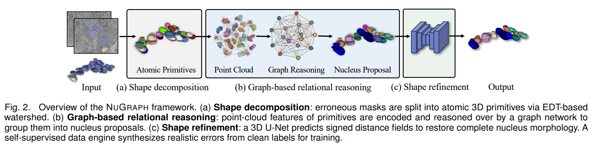

# `NuGraph: Graph-Based Reasoning over 3D Primitives for Nucleus Segmentation Correction`

> `Graph-Based Error Correction for Nucleus Segmentation in Volume Electron Microscopy`

## Authors

**Mingzhi Wang**<sup>1</sup>, **Peng Liu**<sup>2</sup>, **Yi Zhao**<sup>2</sup>, **Bingzhang Wang**<sup>1</sup>, **Jia Wan**<sup>1</sup>, **Liqiang Nie**<sup>1</sup>, **Donglai Wei**<sup>2</sup>

<sup>1</sup> `School of Computer Science and Technology, Harbin Institute of Technology (Shenzhen)`  
<sup>2</sup> `Department of Computer Science, Boston College`

## Links

- **Paper**: [`Paper Link`](https://www.biorxiv.org/content/biorxiv/early/2026/05/19/2026.05.16.725603.full.pdf)
- **Hugging Face Dataset**: [`Dataset`](https://huggingface.co/datasets/Mingzhi618/NucEMFix)
- **Code Repository**: [`GitHub`](https://github.com/MingzhiWang618/NucEMFix)

[](https://www.biorxiv.org/content/biorxiv/early/2026/05/19/2026.05.16.725603.full.pdf)
[](https://huggingface.co/datasets/Mingzhi618/NucEMFix)
[](https://github.com/MingzhiWang618/NucEMFix)

---

## Table of Contents

- [Updates](#updates)
- [Introduction](#introduction)
- [Highlights](#highlights)
- [Framework](#framework)
- [Project Structure](#project-structure)
- [Installation](#installation)
- [Usage](#usage)
- [Results](#results)
- [Citation](#citation)
- [Acknowledgement](#acknowledgement)
- [License](#license)

---

## Updates

- [05/2026] Initial release

---

## Introduction

Correcting segmentation errors in large-scale 3D nuclei reconstructions requires reasoning about which fragments belong to the same nucleus across densely packed regions. Existing correction methods rely on local pairwise fragment matching, which cannot resolve the global topology of nuclear clusters and fails to recover missing morphology. We propose NUGRAPH, a graph-based reasoning framework that operates over atomic 3D primitives obtained by decomposing erroneous masks. NUGRAPH encodes primitive geometry via a 3D point-cloud backbone and performs global relational reasoning through graph attention, capturing inter-primitive dependencies across entire clusters rather than isolated pairs. A primitive–proposal contrastive loss aligns local primitive features with nucleus-level semantics, improving grouping accuracy in dense regions. The resulting proposals are then refined by a shape-refinement network that predicts signed distance fields to restore smooth morphology. To train without manual error annotations, we develop a self-supervised data engine that synthesizes realistic segmentation errors from clean nuclei labels. To benchmark correction at brain scale, we curate NucEMFix, the first brain-wide EM benchmark of nuclei error cases across FAFB and MICrONS (8,000+ annotated error nuclei). NUGRAPH attains 87.99% F1 on NucEMFix-F (FAFB) and 86.20% on NucEMFix-M (MICrONS), outperforming both re-segmentation baselines (e.g., +8.6% over nnU-Net) and pairwise correction methods, while reducing curation effort by over 100× relative to manual proofreading.

We present the method implementation and comparison baselines in this repository.

---

## Highlights

- We propose NUGRAPH, a graph-based framework that reasons over 3D primitives to correct nucleus segmentation errors globally rather than pairwise.
- We curate **NucEMFix**, the first brain-wide EM benchmark with 8,000+ annotated error nuclei across FAFB and MICrONS.
- We provide re-implementations of four comparison baselines (Cellpose, nnU-Net, StarDist, 3D U-Net).
- NUGRAPH reduces manual proofreading effort by over **100×** while achieving state-of-the-art correction accuracy.

---

## Framework



**Figure 1.** The proposed NuGraph pipeline. Erroneous masks are decomposed into atomic 3D primitives. A point-cloud backbone encodes primitive geometry; GATv2 graph attention performs global relational reasoning across primitives. A primitive–proposal contrastive loss guides grouping. A shape-refinement network predicts signed distance fields to restore smooth morphology.

---

## Project Structure

```text
NucEMFix/
├── src/
│   ├── datasets/graph/         # Graph model dataset utilities
│   ├── models/
│   │   ├── graph/
│   │   │   ├── pointNet2/      # PointNet++ graph model
│   │   │   └── sparseUNet/     # Sparse U-Net + GATv2 (primary)
│   │   └── sdf/                # SDF completion model
│   ├── pipeline/
│   │   ├── correct.py          # Single-image correction pipeline
│   │   └── batch_correct.py    # Batch correction with evaluation
│   └── utils/graph/            # Alignment, evaluation, graph construction
├── baselines/
│   ├── cellpose/               # Cellpose baseline
│   ├── nnunet/                 # nnU-Net (DynUNet) baseline
│   ├── stardist/               # StarDist baseline
│   ├── unet/                   # 3D U-Net (BC) baseline
│   │   ├── model/model.py      # UNet3D_BC architecture
│   │   └── dataset/dataset.py  # BCDataset
│   ├── prepare_data/           # Data preparation for baselines
│   └── evaluate_all.py         # Aggregate metrics across result JSONs
├── scripts/
│   ├── train_pointnet2.py      # Train PointNet++ graph model
│   ├── evaluate_segmentation.py# Evaluate segmentation metrics
│   ├── prepare_data.py         # Data preparation utilities
│   └── run_correction.sh       # Batch correction shell script
├── configs/
│   └── default.yaml            # Default hyperparameters
├── checkpoints/                # Pre-trained model weights (see below)
├── data/                       # Input data (not tracked by git)
└── requirements.txt
```

---

## Installation

### 1. Clone the repository

```bash
git clone https://github.com/MingzhiWang618/NucEMFix.git
cd NucEMFix
```

### 2. Create and activate conda environment

```bash
conda create -n nucemfix python=3.8
conda activate nucemfix
```

### 3. Install PyTorch

```bash
pip install torch==1.13.1+cu117 torchvision --extra-index-url https://download.pytorch.org/whl/cu117
```

### 4. Install remaining dependencies

```bash
pip install -r requirements.txt
```

### 5. Install PointNet++ CUDA operators

```bash
pip install pointnet2_ops
```

> **Note**: `spconv` and `torch_geometric` must match your CUDA version.  
> See the [spconv install guide](https://github.com/traveller59/spconv) and [PyG install guide](https://pytorch-geometric.readthedocs.io/en/latest/install/installation.html).

### System Requirements

| Component | Minimum |
|-----------|---------|
| Python | 3.8+ |
| PyTorch | 1.10+ |
| CUDA | 11.0+ |
| GPU VRAM | 12 GB |

Tested on Ubuntu 20.04 with NVIDIA A100 (80 GB).

---

## Usage

### 1. Download dataset

```bash
pip install -U huggingface_hub
huggingface-cli download Mingzhi618/NucEMFix \
  --repo-type dataset \
  --local-dir ./data \
  --local-dir-use-symlinks False
```

The `data/` directory should look like:

```text
data/
├── FAFB/
│   ├── img/
│   ├── seg/
│   └── correct/
└── MICrONS/
    ├── img/
    ├── seg/
    └── correct/
```

### 2. Prepare data

To prepare HDF5 training datasets from segmentation volumes:

```bash
python scripts/prepare_data.py \
    --seg_dir data/FAFB/seg \
    --correct_dir data/FAFB/correct \
    --output_h5 data/train.h5
```

**Slice offsets JSON format** (`slice_offsets.json`), if available:

```json
{
  "<file_id>": {
    "relative_shifts": [
      {"from_slice": 0, "to_slice": 1, "dx": 2.0, "dy": -1.0, "status": "ok"}
    ],
    "bad_slices": [5, 12]
  }
}
```

### 3. Train

```bash
python scripts/train_pointnet2.py \
    --train_h5 data/train.h5 \
    --val_h5 data/val.h5 \
    --save_dir checkpoints/ \
    --epochs 100 \
    --batch_size 8 \
    --lr 1e-3 \
    --device cuda
```

### 4. Inference

**Single image:**

```bash
python src/pipeline/correct.py \
    --img_path data/FAFB/img/sample.tiff \
    --seg_path data/FAFB/seg/sample.tiff \
    --offsets_json data/slice_offsets.json \
    --output_dir results/ \
    --graph_model_path checkpoints/graph_model.pth \
    --sdf_model_path checkpoints/sdf_model.pth \
    --device cuda:0
```

**Batch correction:**

```bash
bash scripts/run_correction.sh
```

Or directly:

```bash
python src/pipeline/batch_correct.py \
    --base_dir data/ \
    --output_dir results/ \
    --output_json results/batch_results.json \
    --graph_model_path checkpoints/graph_model.pth \
    --sdf_model_path checkpoints/sdf_model.pth \
    --device cuda:0 \
    --num_workers 2
```

### 5. Evaluate

```bash
python scripts/evaluate_segmentation.py \
    --pred_dir results/ \
    --correct_dir data/FAFB/correct/ \
    --output_json results/metrics.json \
    --iou_threshold 0.75
```

### 6. Baselines

We provide re-implementations of four comparison methods under `baselines/`:

| Method | Paper |
|--------|-------|
| Cellpose | [Stringer et al., 2021](https://www.nature.com/articles/s41592-020-01018-x) |
| nnU-Net (DynUNet) | [Isensee et al., 2021](https://www.nature.com/articles/s41592-020-01008-z) |
| StarDist | [Schmidt et al., 2018](https://arxiv.org/abs/1806.03535) |
| 3D U-Net (BC) | [Çiçek et al., 2016](https://arxiv.org/abs/1606.06650) |

Example (StarDist):

```bash
python baselines/stardist/correct.py \
    --img_path data/FAFB/img/sample.tiff \
    --seg_path data/FAFB/seg/sample.tiff \
    --output_dir results/stardist/ \
    --model_basedir checkpoints/stardist/models \
    --device cuda:0
```

Aggregate results across methods:

```bash
python baselines/evaluate_all.py results/method1.json results/method2.json
```


## Citation

```bibtex
@article{Wang2026.05.16.725603,
  title     = {NuGraph: Graph-Based Reasoning over 3D Primitives for Nucleus Segmentation Correction},
  author    = {Wang, Mingzhi and Liu, Peng and Zhao, Yi and Wang, Bingzhang and Wan, Jia and Nie, Liqiang and Wei, Donglai},
  year      = {2026},
  doi       = {10.64898/2026.05.16.725603},
  publisher = {Cold Spring Harbor Laboratory},
  URL       = {https://www.biorxiv.org/content/early/2026/05/19/2026.05.16.725603},
  eprint    = {https://www.biorxiv.org/content/early/2026/05/19/2026.05.16.725603.full.pdf},
  journal   = {bioRxiv}
}
```

---

## Acknowledgement

This work was supported by the National Science Foundation (NSF) CAREER Award (IIS-2239688), National Natural Science Foundation of China under Project 62406090, and Lingang Laboratory, Grant No. LGL-1987-03.

This project uses [PointNet++](https://github.com/erikwijmans/Pointnet2_PyTorch), [spconv](https://github.com/traveller59/spconv), and [torch_geometric](https://github.com/pyg-team/pytorch_geometric).

---

## License

This project is released under the MIT License — see [LICENSE](LICENSE) for details.
